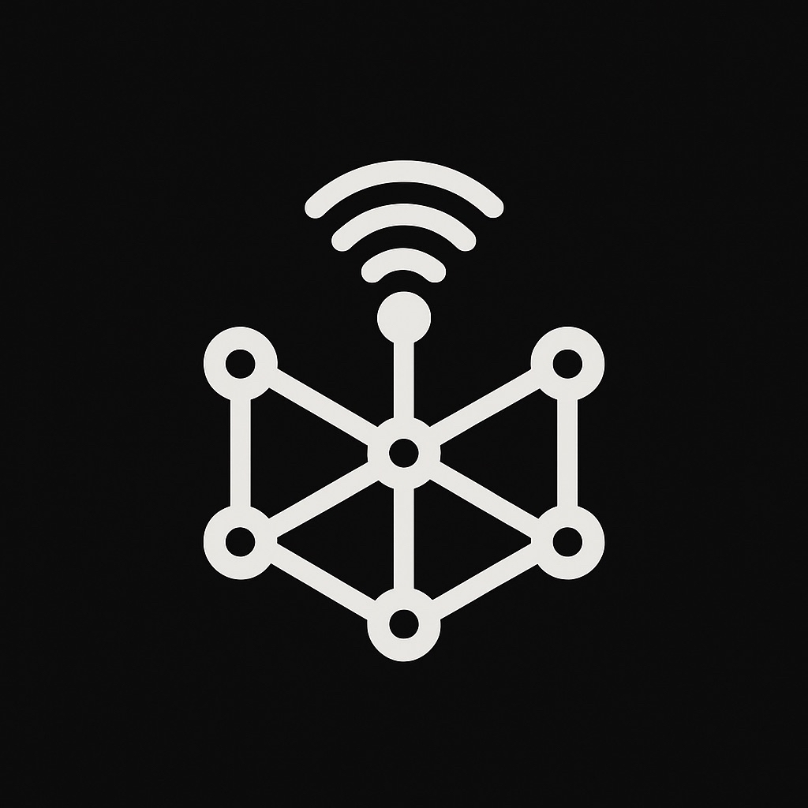

<!-- Future Logo Here -->
A community project dedicated to providing information for the Meshtastic network in the state of Tennessee.

Want to learn more about connecting to the mesh? Check out our [recommended settings](/guides/settings) guide!

!!! note "Upcoming Events"

    - <h3>[Nashville Meetup at 4Wall Entertainment, January 7th at 7pm](events/2025/12/23/nashville-meetup-at-4wall-entertainment-january-7th-at-7pm/)</h3>

## Resources

- [💬 TNMesh Discord](https://discord.gg/7bFRR8Jt22){ .md-button .md-button--primary .md-button__fill}
- [📊 Malla](https://malla.tnmesh.org){ .md-button .md-button--primary .md-button__fill}
- [ℹ️ MeshInfo](https://meshinfo.tnmesh.org){ .md-button .md-button--primary .md-button__fill}
- [🥔 Potato Map](https://potato.tnmesh.org){ .md-button .md-button--primary .md-button__fill}
- [📍 MQTT Map](https://map.tnmesh.org){ .md-button .md-button--primary .md-button__fill}

## Connect to a Mesh Community

<figure markdown="span">
        { width="75"}
        <figcaption>
                Middle Tennessee 
                *Preset:* `Medium_Fast` 
                *Frequency Slot:* `45` 
                [NashMesh](http://nashmesh.com)
        </figcaption>
</figure>

<figure markdown="span">
        { width="75"}
        <figcaption>
                Middle/East Tennessee 
                *Preset:* `Long_Fast` 
                [KBLAST Mesh](https://discord.gg/BQayUwxc56)
        </figcaption>
</figure>

Want your community added? Open a [pull request](https://github.com/tnmesh/homepage/pulls)!